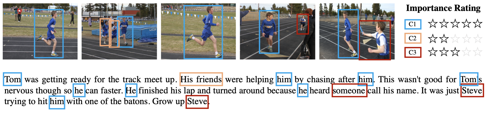

# VIST-Character
This repository contains the dataset and accompanying code presented in the AAAI 2023 paper: [Detecting and Grounding Important Characters in Visual Stories](https://arxiv.org/abs/2303.17647).

## Dataset Description



VIST-Character dataset augments 770 samples from the test split of [VIST dataset](https://aclanthology.org/N16-1147/) with rich character-centric annotations, including visual and textual co-reference chains and importance ratings for characters.

**Download the dataset:** The dataset is hosted on Google Drive, and you can download it from [here](https://drive.google.com/file/d/1CNZH6cAeQLAvS-fLJgo1pdFb9_gdWzG6/view).


## Data Format
The dataset is contained in a single JSON file, with each data point represented as a JSON object. The structure of a sample JSON object is as follows:
```
{
    "story": "the original VIST story",
    "meta_date": {
        "story_id": "the original VIST story id",
        "img_id": ["img_1_id", "img_2_id", ..., "img_5_id"]
    },
    "gt_char": {
        "C1": {
            "coref": [{
                        "start": index of the first token in the story,
                        "end": index of the lsat token in the story,
                        "text": the textual character mention,
                        "labels": character label (C_k),
                    },
                    ...,
            ],
            "plural": "yes/no",
            "bboxes": {
                "img1": [{
                    "x": float,
                    "y": float,
                    "width": float,
                    "height": float,
                    "rectanglelabels": character label (C_k),
                },
                ...]
                "img5": [{bbox_1}, {bbox_2}, ...],
            },
            "rating": "importance of character on a scale of 1 to 5",
        },
        ...,
        "Cn": {
            ...
        },
    },
    "quality": the story quality on a scale of Great/Acceptable/Unacceptable.
}
```

## Baseline and Visualization Code

coming soon

## Citation

The purpose of this repository is to facilitate reproducibility and encourage further research using the dataset and code provided. If you use this dataset or code in your work, please cite our paper:
```bibtex
@article{liu2023detecting,
  title={Detecting and Grounding Important Characters in Visual Stories},
  author={Liu, Danyang and Keller, Frank},
  journal={arXiv preprint arXiv:2303.17647},
  year={2023}
}
```
